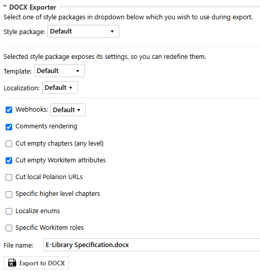
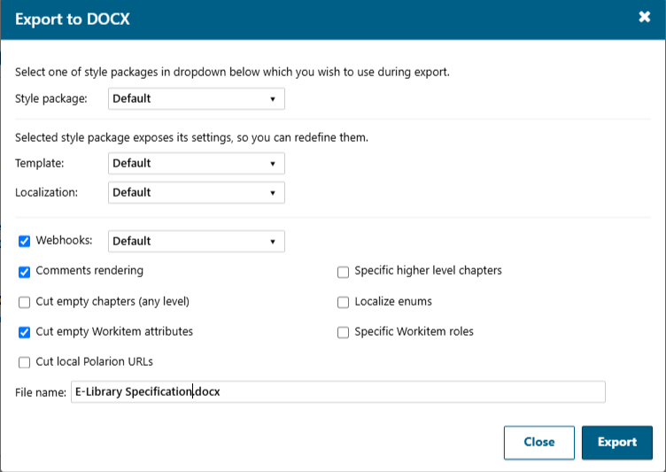
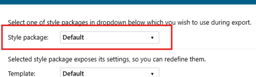
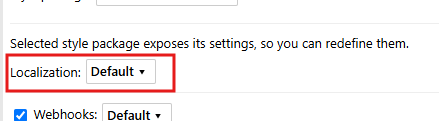

* [Export panel layout](#export-panel-layout)
* [Style packages](#style-packages)
* [Options](#options)
    * [Localization](#localization)
    * [Webhooks](#webhooks)
    * [Comments rendering](#comments-rendering)
    * [Cut empty chapters](#cut-empty-chapters)
    * [Cut empty Workitem attributes](#cut-empty-workitem-attributes)
    * [Cut local Polarion URLs](#cut-local-polarion-urls)
    * [Specific higher level chapters](#specific-higher-level-chapters)
    * [Localize enums](#localize-enums)
    * [Specific Workitem roles](#specific-workitem-roles)
    * [File name](#file-name)

## Export panel layout
As the extension is installed and configured to appear on Document Properties pane, you can open any document in a project where you configured DOCX exporter, open Document Properties sidebar and you will see following section added there:

If you use bulk export or button from the toolbar, Live Report or Test Run pages then modal popup appears with the same options but slightly different layout:

## Style packages
All exporter settings are combined into named style packages. Different packages can be configured different way as well as can hide their settings from being redefined by end user. In such a case you will be able only to select a package
to use without possibility to redefine its settings:

## Options
A package can also expose its options to be redefined by end user before exporting a document into DOCX.

### Localization
The same relates to localization settings, which one to use during DOCX generation can be selected in next dropdown:

### Webhooks
In this section you can choose specific webhook for custom HTML processing before sending it to Pandoc:

### Comments rendering
This option which is on by default tells DOCX Exporter to include Polarion document's comments into generated DOCX document (REMARK: please take into account that this relates only to LiveDoc comments, WorkItem comments regardless the fact
they look like LiveDoc comments **won't be displayed** in generated DOCX under any circumstances).
If you though don't want comments to be included in generated DOCX document - just un-check this checkbox.

### Cut empty chapters
If you select this checkbox empty chapters of any level will be excluded from being exported, like these selected in screenshot:

### Cut empty Workitem attributes
This option which is on by default tells DOCX Exporter to exclude empty WorkItem attributes from resulted DOCX document. Empty Workitem attribute in Polarion document (tabular representation):

### Cut local Polarion URLs
If you select this checkbox all anchors which link to local Polarion resources will be cut off leaving only text they contain:

### Specific higher level chapters
If you select this checkbox an input field will appear where you can specify which high-level chapters (as comma separated list of numbers) to be exported:

### Localize enums
If you check this checkbox and select some non-English language from appeared dropbox:

Enumeration values which translations into specified language are provided in administration will be replaced by their translations in resulted DOCX document.

Enumeration values in Polarion document:

As a result are replaced by their translations:

### Specific Workitem roles
If you check this checkbox and select only certain roles of Workitem relations:

...then among all possible Linked Workitems:

...will be taken only those which correspond selected roles (both direct and reverse directions):

And here is the resulted DOCX document:

### File name
Here you can specify the resulting file name:

Note that the pre-generated value can be defined on the 'Filename' administration pane. There you can configure a schema for the generation of the used DOCX-filename. Variables can be used as well.
